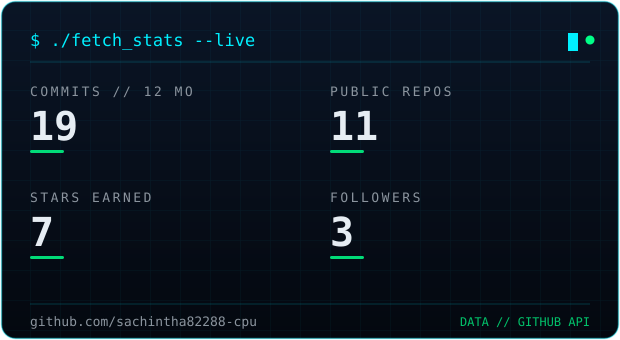

<!-- ═════════════════════════════════════════════════════════════════════════ -->
<!--  sachintha82288-cpu — profile README                                      -->
<!--                                                                           -->
<!--  Everything animated here is either committed as a file in this repo      -->
<!--  (assets/*.svg, generated/*.svg — plain SMIL SVGs, rendered by GitHub)    -->
<!--  or comes from a service that is verified alive. No dead Vercel cards,    -->
<!--  no emojis.                                                               -->
<!--                                                                           -->
<!--  generated/*.svg is regenerated daily by                                  -->
<!--  .github/workflows/refresh-profile.yml from live GitHub data.             -->
<!--  The age inside generated/terminal.svg self-updates on every birthday     -->
<!--  via .github/scripts/update_age.py (birth date lives there).              -->
<!-- ═════════════════════════════════════════════════════════════════════════ -->

  

  

<!-- AGE_BADGE:START -->

<!-- AGE_BADGE:END -->

  

  

## 「 SYSTEM PROFILE 」

| field | detail |
| :--- | :--- |
| `alias` | **Sachintha** |
| `age` | <!-- AGE_TEXT:START -->**16 years old**  ·  born 11 December 2009<!-- AGE_TEXT:END --> |
| `base` | `Kegalle`, Sri Lanka |
| `school` | Dr. N. M. Perera Central College |
| `rank` | student · self-taught developer |
| `motto` | *learn in silence, ship in public* |

  

## 「 SYSTEM METRICS 」

*self-generated from the live GitHub API — rebuilt daily, hosted by this repo itself.*

  
  

  

## 「 CONTRIBUTION MATRIX 」

*self-drawn activity grid — the snake hunts on the graph below it.*

  

  <picture>
    <source media="(prefers-color-scheme: dark)" srcset="https://raw.githubusercontent.com/sachintha82288-cpu/sachintha82288-cpu/output/github-snake-dark.svg" />
    <source media="(prefers-color-scheme: light)" srcset="https://raw.githubusercontent.com/sachintha82288-cpu/sachintha82288-cpu/output/github-snake.svg" />
    
  </picture>

  

### 「 ./stay_encrypted.sh 」

**what happens in the terminal, stays in the terminal.**

 

